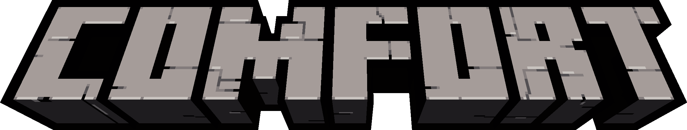

Comfort is a **Forge 1.18.2 Modpack** centered around **Building**, **Cooking** and **Automating**.

# About

## Comfort

## Building

Leave your mark on the world by creating comfortable homesteads of grande factories!

## Cooking

Food serves more purposes than just satiating your hunger. Eating a wide veriety of food will give you permanent benefits, so don't be picky about what you eat!

## Automation

Every common material is renewable, allowing players to create factories which shouldn't require any maintenence or restocking to run!

# Join

Looking for a server to play on? Join the Comfort SMP at `comfort.sindercu.be`!

# Mods

<b>General</b>

- [Abnormals]
    - [Delight]
- [Allurement](https://www.curseforge.com/minecraft/mc-mods/allurement)
- [Antique Atlas](https://www.curseforge.com/minecraft/mc-mods/antique-atlas)
- [Artifacts](https://www.curseforge.com/minecraft/mc-mods/artifacts)
- [Environmental]
- [Infernal Expansion]
- [Haunted Harvest]
- [Mannequins](https://www.curseforge.com/minecraft/mc-mods/mannequins)
- [ComputerCraft: Tweaked](https://www.curseforge.com/minecraft/mc-mods/cc-tweaked)
- [Continents](https://www.curseforge.com/minecraft/mc-mods/continents)
- [Domestication Innovation](https://www.curseforge.com/minecraft/mc-mods/domestication-innovation)
- [Ender Mail](https://www.curseforge.com/minecraft/mc-mods/ender-mail)
- [Goblin Traders](https://www.curseforge.com/minecraft/mc-mods/goblin-traders)
- [Guns Without Roses](https://www.curseforge.com/minecraft/mc-mods/guns-without-roses)
- [Storage Labels](https://www.curseforge.com/minecraft/mc-mods/labels)
- [Quark](https://www.curseforge.com/minecraft/mc-mods/quark)
- [Serene Seasons](https://www.curseforge.com/minecraft/mc-mods/serene-seasons)
- [Supplementaries](https://www.curseforge.com/minecraft/mc-mods/supplementaries)
- [Unvoted and Shelved](https://www.curseforge.com/minecraft/mc-mods/unvoted-shelved)
- [Waystones](https://www.curseforge.com/minecraft/mc-mods/waystones)

<b>Building</b>

- [Architect's Palette](https://www.curseforge.com/minecraft/mc-mods/architects-palette)
- [Bagel's Palette Blocks](https://www.curseforge.com/minecraft/mc-mods/bagels-palette-blocks)
- [Clayworks](https://www.curseforge.com/minecraft/mc-mods/clayworks)
- [Consistency+](https://www.curseforge.com/minecraft/mc-mods/consistencyplus)
- ['Dustrial Decor](https://www.curseforge.com/minecraft/mc-mods/dustrial-decor)
- [Immersive Weathering](https://www.curseforge.com/minecraft/mc-mods/immersive-weathering)
- [Moyai](https://www.curseforge.com/minecraft/mc-mods/moyai)
- [Sooty Chimneys](https://www.curseforge.com/minecraft/mc-mods/sooty-chimneys)
- [Twigs](https://www.curseforge.com/minecraft/mc-mods/twigs)

<b>Cooking</b>

- [Farmer's Delight](https://www.curseforge.com/minecraft/mc-mods/farmers-delight)
    - [Brewin' and Chewin'](https://www.curseforge.com/minecraft/mc-mods/brewin-and-chewin)
    - [Bundle of Joy](https://www.curseforge.com/minecraft/mc-mods/farmers-bundle-of-joy)
    - [Farmer's Delight](https://www.curseforge.com/minecraft/mc-mods/farmers-delight)
    - [Farmer's Respite](https://www.curseforge.com/minecraft/mc-mods/farmers-respite)
    - [Miner's Delight](https://www.curseforge.com/minecraft/mc-mods/miners-delight)
- [Incubation](https://www.curseforge.com/minecraft/mc-mods/incubation)
- [Le Fishe Exotique Au Chocolat](https://www.curseforge.com/minecraft/mc-mods/le-fishe-exotique-au-chocolat)

<b>Automating</b>

- [Create](https://www.curseforge.com/minecraft/mc-mods/create)
    - [Central Kitchen](https://www.curseforge.com/minecraft/mc-mods/create-central-kitchen)
    - [Confectionery](https://www.curseforge.com/minecraft/mc-mods/create-confectionery)
    - [Crystal Clear](https://www.curseforge.com/minecraft/mc-mods/create-crystal-clear)
    - [Decorations](https://www.curseforge.com/minecraft/mc-mods/create-deco)
    - [Enchantment Industry](https://www.curseforge.com/minecraft/mc-mods/create-enchantment-industry)
    - [Stuff and Additions](https://www.curseforge.com/minecraft/mc-mods/create-stuff-additions)
    - [ComputerCraft Bridge](https://www.curseforge.com/minecraft/mc-mods/cccbridge)
    - [Steam 'n Rails]

